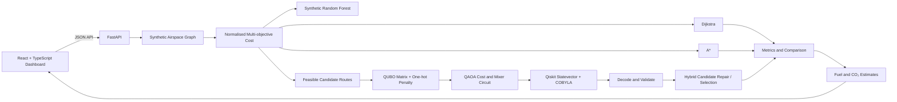

# AeroQ — Quantum-Assisted Low-Emission Flight Path Optimisation

> **Research and simulation prototype only.** AeroQ does not provide certified aviation navigation, operational flight planning, air-traffic-control, pilot instructions, or aviation safety advice. All airspace geometry and operating conditions in the included demo are synthetic.

AeroQ compares classical graph search with a reduced QUBO/QAOA workflow. Its goal is to make the optimisation pipeline understandable: inspect a flight scenario, see the airspace graph, compare route metrics, examine the binary objective, and learn how a local quantum-circuit simulator evaluates candidate selections.

## Included capabilities

- Reproducible 12-node synthetic airspace graph with 24 segments.
- Configurable distance, fuel, CO₂, wind, weather, congestion, delay, and restriction factors.
- Dijkstra and A* classical routing baselines.
- Candidate-route QUBO: `E(x) = Σ cᵢxᵢ + P(Σxᵢ − 1)²`.
- QAOA cost/mixer layers, local Qiskit `Statevector` circuit evaluation, COBYLA parameter search, and sampled bitstrings when Qiskit is installed.
- An explicitly labelled NumPy state-vector fallback if Qiskit is not available. A fallback is never described as Qiskit execution.
- Hybrid post-processing and route-feasibility reporting.
- Fuel/CO₂ demonstration estimates, with the illustrative factor `3.16 kg CO₂ per kg fuel` documented in the backend.
- Random Forest fuel surrogate trained and evaluated on synthetic held-out data.
- Typed React + TypeScript dashboard with route graph, scenario controls, QUBO matrix, probability histogram, benchmark views, sensitivity sweep, experiment log, and methodology page.
- Local experiment history stored in `data/experiments.json`.

## Architecture



### Important implementation distinction

The QUBO in this prototype uses one binary variable per candidate route. Its one-hot penalty encourages selecting exactly one route. This is a reduced demonstrator, not a complete operational air-traffic model. Dijkstra and A* remain classical algorithms. QAOA uses a parameterized quantum circuit evaluated by a local state-vector simulator; no real quantum hardware or quantum annealer is used.

## Requirements

- Python 3.11+ recommended (Python 3.13 is supported by compatible current packages).
- Node.js 20+ and npm.
- Internet access on first installation to download Python and npm packages.

Qiskit is included in `requirements.txt`. If the local environment cannot install or execute Qiskit, AeroQ can still start using the explicitly labelled NumPy state-vector fallback. To verify the actual Qiskit path, install dependencies successfully and check the Quantum Lab backend label.

## Windows installation (PowerShell)

Run these commands from the extracted project root (the directory containing `requirements.txt`).

### 1. Create and activate a virtual environment

```powershell
py -3.13 -m venv venv
.\venv\Scripts\Activate.ps1
```

If PowerShell blocks activation, run this in the same terminal, then activate again:

```powershell
Set-ExecutionPolicy -Scope Process -ExecutionPolicy Bypass
.\venv\Scripts\Activate.ps1
```

### 2. Install backend dependencies

```powershell
python -m pip install --upgrade pip
python -m pip install -r requirements.txt
```

### 3. Start the backend

```powershell
python -m uvicorn backend.app.main:app --reload --port 8000
```

Keep this terminal open. Check:

- API health: <http://127.0.0.1:8000/api/health>
- Swagger docs: <http://127.0.0.1:8000/docs>

### 4. Install and start the frontend in a second terminal

```powershell
cd frontend
npm install
npm run dev
```

Open the exact URL printed by Vite, usually <http://localhost:5173/>. Keep both terminals open while using AeroQ.

### One-click Windows startup

After dependencies have been installed, from the project root you can run `run_backend.bat` and `run_frontend.bat` in two separate terminals/windows. If no `venv` exists, create it and install backend dependencies first using the steps above.

## Other operating systems

Backend:

```bash
python -m venv .venv
source .venv/bin/activate
python -m pip install -r requirements.txt
python -m uvicorn backend.app.main:app --reload --port 8000
```

Frontend (another terminal):

```bash
cd frontend
npm install
npm run dev
```

## Tests and checks

Backend tests:

```powershell
python -m pytest -q
```

Frontend type-check and build:

```powershell
cd frontend
npm run typecheck
npm run build
```

A test for the QUBO-to-Ising energy mapping runs without Qiskit. The Qiskit integration test is skipped if Qiskit is not installed; after dependency installation it exercises circuit construction and local Statevector execution.

## API endpoints

- `GET /api/health`
- `GET /api/scenarios`
- `POST /api/graph/generate`
- `POST /api/optimize`
- `POST /api/optimize/classical`
- `POST /api/qubo/build`
- `POST /api/quantum/qaoa`
- `POST /api/optimize/hybrid`
- `POST /api/optimize/compare`
- `POST /api/sensitivity`
- `GET /api/experiments`
- `POST /api/ml/predict`
- `GET /api/ml/model-info`
- `GET /api/methodology`

## Troubleshooting

**`python` is not found on Windows:** use `py -3.13 -m venv venv`, activate the environment, then use `python` inside the activated environment. If needed, fix the Windows App Execution Aliases / PATH settings.

**`npm install` fails:** check `node --version` and `npm --version`, confirm network access, and retry `npm install` in `frontend`.

**`Backend disconnected`:** keep the FastAPI terminal open and check `http://127.0.0.1:8000/api/health`. The frontend defaults to `http://127.0.0.1:8000/api` and allows `localhost:5173` and `127.0.0.1:5173` through CORS.

**Quantum Lab says NumPy fallback:** install the project's `requirements.txt` successfully, then restart the backend. The UI shows the actual backend label and does not claim that fallback measurements came from Qiskit.

**No feasible measured one-hot bitstring:** QAOA may fail to sample a valid candidate under the configured settings. The API reports that honestly; the hybrid stage separately uses the classical feasibility repair. Increase shots / adjust layers only as a research experiment; this does not establish quantum advantage.

## Scientific and safety limitations

- The synthetic node coordinates are not real navigation coordinates.
- All route and emissions values are simulation estimates.
- The Random Forest is trained on generated demonstration data, not airline/aircraft telemetry. Test metrics describe only a synthetic holdout set.
- Runtime depends on machine, package versions and execution settings.
- Local statevector simulation grows exponentially with qubit count, so the quantum model is deliberately small.
- No claim of quantum advantage, certified emissions reduction, aviation certification, or operational safety is made.
