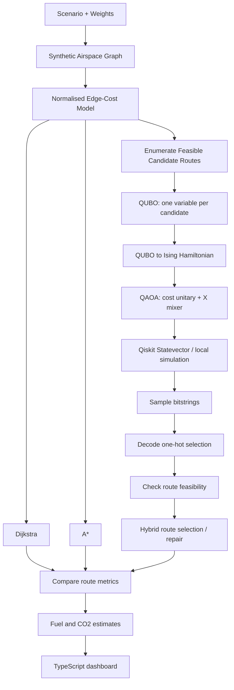

# AeroQ Architecture and Mathematical Notes

## Pipeline

## Multi-objective route cost

For each segment, continuous features are normalised before weighted combination:

`edge_cost = wd * distance_norm + wf * fuel_norm + we * co2_norm + wc * congestion + wl * delay + ww * weather_norm + restriction_penalty + ml_adjustment`

The same `CostModel.edge_cost()` is used by classical graph search and candidate-route evaluation so comparison is meaningful within this prototype.

## Candidate-route QUBO

Let each enumerated route candidate be indexed by `i`, with binary selection variable `x_i`. Let `c_i` be its route objective and let `P` be a penalty coefficient:

`E(x) = Σ_i c_i x_i + P(Σ_i x_i - 1)^2`

Expanding produces linear diagonal terms and pairwise quadratic terms. The penalty encourages one-hot selection. Candidate feasibility is checked separately against maximum distance and restricted segment constraints.

## QUBO-to-Ising conversion

For each binary variable, substitute `x_i = (1 - Z_i)/2`. The QUBO is converted to:

`H_C = offset + Σ_i h_i Z_i + Σ_(i<j) J_ij Z_i Z_j`

The circuit implements the diagonal cost unitary with RZ and RZZ rotations and uses RX rotations as the QAOA mixer. A unit test verifies that the Ising energy equals the original QUBO energy for every bitstring of a small model.

## QAOA workflow

1. Initialise every qubit in the `|+>` state.
2. Apply the parameterised cost unitary.
3. Apply the X-mixer unitary.
4. Repeat for `p` layers.
5. Use COBYLA to tune the angle parameters by expected energy.
6. Sample final-state probabilities.
7. Decode only an observed one-hot state as a candidate route; otherwise report that no feasible candidate was measured.

Qiskit's local `Statevector` simulator is used when installed. The dependency-light NumPy state-vector implementation is an explicitly labelled fallback. Neither path uses quantum hardware.

## Fuel and CO2

Fuel and emissions are simplified demonstration estimates based on segment distance and synthetic fuel-burn, wind, congestion and weather factors. The conversion factor used by this prototype is `3.16 kg CO2 / kg fuel`; it is an assumption for the project demo, not a certified flight-level calculation.

## AI/ML

A `RandomForestRegressor` is trained on generated data, with a held-out split and reported test R², MAE and RMSE. The reported metrics must not be interpreted as evidence of real aviation prediction accuracy.
